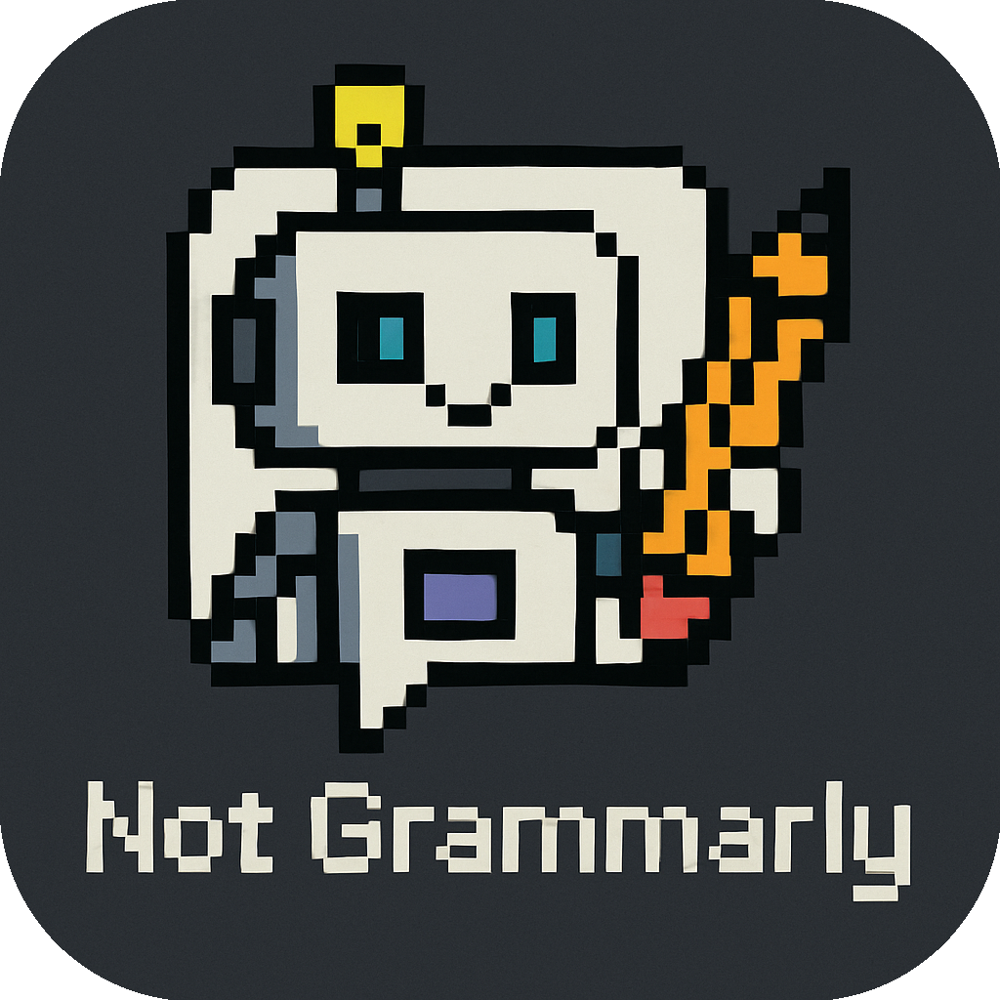

# Not Grammarly

<p align="center">
  
</p>

Poor Man's Grammarly - because who needs expensive subscriptions anyway?  lightweight desktop app that helps fix your writing.

<p align="center">
  <a href="https://www.not-grammarly.com">
    <strong>📥 Download Not Grammarly Now 📥</strong>
  </a>
</p>

## Demo

<p align="center">
  
</p>

## About

A simple grammar checker built over a weekend. It's a free alternative to expensive writing tools, using OpenAI to help improve your writing. Just paste your text and get instant suggestions to make your writing better.

## Features

- Grammar checking with scoring and detailed explanations
- Text refinement with multiple style options (formal, informal, concise, etc.)
- Support for multiple languages (English, Spanish, Portuguese)
- Customizable appearance with light/dark mode and transparency controls
- Global keyboard shortcut (Ctrl+Shift+G) to analyze clipboard text
- Always-on-top mode for convenient access while working in other applications

## Installation

1. Visit our website:
```
https://www.not-grammarly.com
```

2. Clone the repository:
```
git clone https://github.com/camilocbarrera/not-grammarly.git
```

3. Install dependencies:
```
cd not-grammarly
npm install
```

4. Start the application:
```
npm start
```

## Usage

1. Select and copy text from any application
2. Press Ctrl+Shift+G to analyze the text
3. View grammar corrections and suggestions
4. Refine the text according to your preferred style
5. Copy the corrected/refined text back to your original application

## Configuration

- API key: You need to provide your own OpenAI API key
- Language settings: Choose source and target languages
- Appearance: Select light, dark, or system theme
- Window behavior: Control transparency and always-on-top setting

## Future Implementations

- Ollama integration for local LLM support
- Multiple model selection (GPT-4, Claude, etc.)
- Custom prompt templates for specific writing tasks
- Automatic language detection improvements
- Speech-to-text capabilities
- Export/import settings
- Spellcheck without API for basic corrections

## Dependencies

- Electron
- OpenAI API
- TailwindCSS

## License

MIT License

## Contributing

Contributions are welcome! Please feel free to submit a Pull Request.

1. Fork the repository
2. Create your feature branch (`git checkout -b feature/amazing-feature`)
3. Commit your changes (`git commit -m 'Add some amazing feature'`)
4. Push to the branch (`git push origin feature/amazing-feature`)
5. Open a Pull Request

## Issues and Feedback

If you encounter any issues or have feedback, please file an issue at:
https://github.com/camilocbarrera/not-grammarly/issues

## Contact

Cristian Camilo Correa Barrera - [LinkedIn](https://www.linkedin.com/in/cristiancamilocorrea/)

## Support

If you find this project useful, consider buying me a coffee:
https://buymeacoffee.com/camilocbarrera

---

Tags: `vibecoding`, `electron`, `openai`, `grammar-checker`, `text-refinement`, `llm`, `desktop-app`, `developer-tools` 